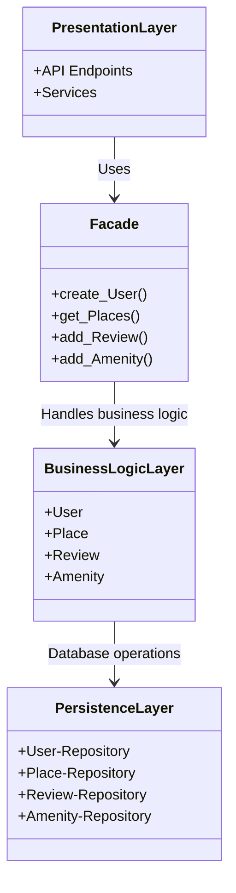
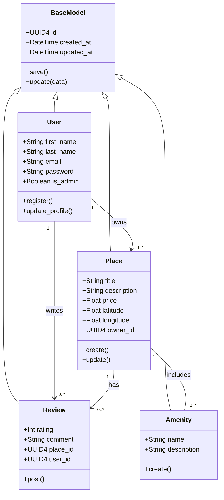
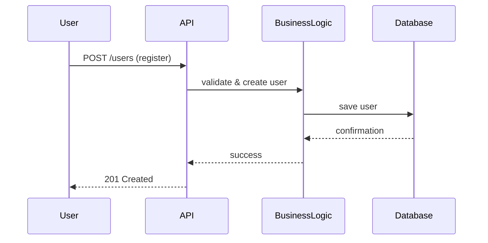
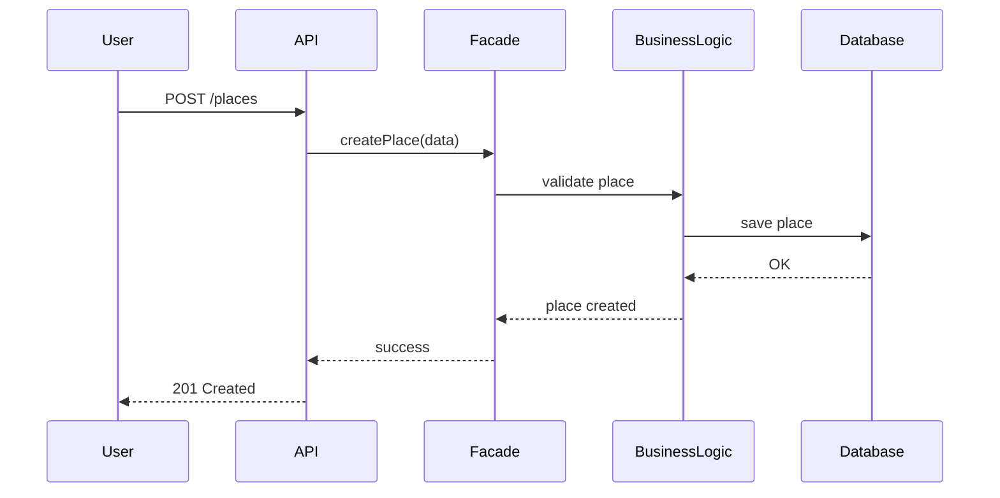
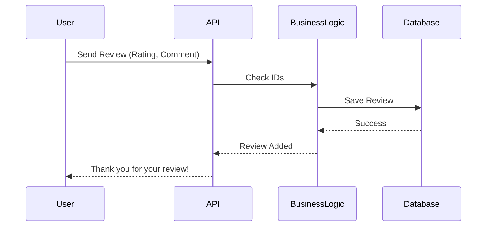

# Holberton School HBnB – Documentation

# TASK 0 - High-Level Package Diagram


Overview

This document presents a high-level package diagram of the HBnB application. The diagram illustrates a three-layer architecture and shows how these layers communicate using the Facade design pattern.

The goal is to provide a clear and structured view of how the system is organized and how its components interact.

Architecture Overview

The HBnB application is built using a layered architecture with three main layers:

Presentation Layer
Business Logic Layer
Persistence Layer

Each layer has its own responsibility and communicates with other layers in a controlled way.

▫️Layer Descriptions


1. Presentation Layer

This is the layer that users interact with directly. It includes API endpoints and Services.

When a user sends a request (for example, creating a user or viewing places), it is received by this layer first. Then the request is passed to the system through the Facade, which acts as the main entry point.


2. Business Logic Layer

This is the core of the application. It defines how the system works and what rules are applied.

It includes:
User
Place
Review
Amenity

In this layer:

Business rules are applied
Data is validated
System logic is handled


3. Persistence Layer

This layer is responsible for storing and retrieving data. It communicates directly with the database.

It includes:

Repository classes (e.g., UserRepository, PlaceRepository)

Its main tasks:

Save data to the database
Retrieve data when needed


▫️ Facade Pattern

The Facade pattern simplifies communication between layers by providing a single interface.

Instead of the Presentation Layer directly communicating with the Business Logic Layer, all requests go through the Facade.

The Facade works like a middle layer that:

Receives requests
Sends them to the correct component
Hides internal complexity


Benefits
Provides one single entry point
Makes the system easier to understand
Improves code organization
Reduces dependency between layers


Communication Flow
The user sends a request to the Presentation Layer
The request goes to the Facade
The Facade calls the Business Logic Layer
The Business Logic Layer interacts with the Persistence Layer
The result is returned back to the user through the same path


# Package Diagram



# TASK 1 - Business Logic Layer

Overview

This document describes the Business Logic layer of the HBnB application. It presents a UML class diagram that models the core entities of the system, their attributes, methods, and relationships.

The main goal is to clearly represent how the business logic is structured and how the main entities interact with each other.


Business Logic Layer

The Business Logic layer contains the main entities of the application:

User
Place
Review
Amenity

These entities represent the core functionality of the system and define the main business rules.

## Class Diagram


# TASK 2 - API Calls
Overview

This document presents two main API flows in the HBnB application using sequence diagrams.
Each diagram illustrates how the Presentation, Business Logic, and Persistence layers interact with each other through the Facade pattern.

The goal is to clearly show the request flow, from the user request to data processing and response return.

# User Registration flow



# Place Creation



# Review Submission Flow



# Fetching a List of Places
```mermaid 
sequenceDiagram

participant User
participant API
participant Facade
participant BusinessLogic
participant Database

User->>API: GET /places
API->>Facade: getPlaces(filters)
Facade->>BusinessLogic: fetch data
BusinessLogic->>Database: query places
Database-->>BusinessLogic: results
BusinessLogic-->>Facade: places list
Facade-->>API: response
API-->>User: 200 OK + data

