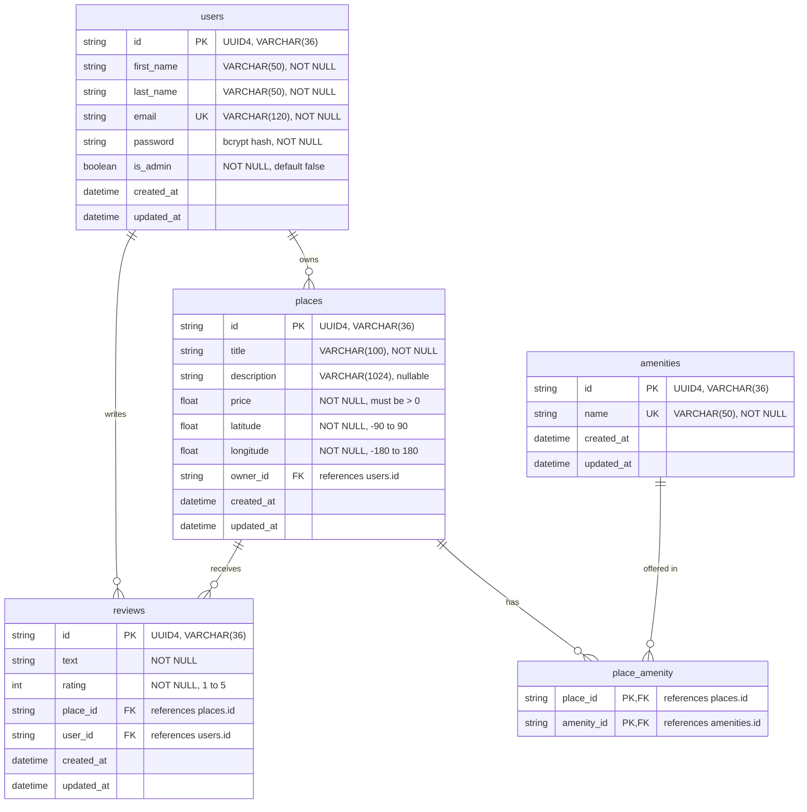

# HBnB Part 3: Database ER Diagram

Entity-Relationship diagram of the HBnB database, written in [Mermaid.js](https://mermaid.js.org/).
It matches `sql/schema.sql` and the SQLAlchemy models in `app/models/`. GitHub and GitLab render the
diagram below automatically. The same diagram is also exported as `er_diagram.png` (image) and
`er_diagram.mmd` (raw Mermaid source, for the Mermaid Live Editor).

## Relationships

| Relationship | Type | How it is implemented |
|--------------|------|-----------------------|
| `users` -> `places` | one-to-many | `places.owner_id` is a foreign key to `users.id` |
| `users` -> `reviews` | one-to-many | `reviews.user_id` is a foreign key to `users.id` |
| `places` -> `reviews` | one-to-many | `reviews.place_id` is a foreign key to `places.id` |
| `places` <-> `amenities` | many-to-many | association table `place_amenity` with the composite primary key (`place_id`, `amenity_id`) |

## Reading the notation

- `||--o{` means "exactly one on the left, zero or more on the right". For example, each place has exactly one
  owner, and a user can own zero or more places.
- A many-to-many relationship cannot be stored directly in SQL, so it is drawn as two one-to-many
  relationships that meet at the association table `place_amenity`.
- `PK` is a primary key, `FK` a foreign key and `UK` a unique key.

## Constraints that the diagram does not show

- `UNIQUE (user_id, place_id)` on `reviews`: a user can review a given place only once.
- Deleting a user, place or amenity cascades to the rows that depend on it (`ON DELETE CASCADE`).
- `CHECK` constraints on `price`, `latitude`, `longitude` and `rating` (ranges shown in the comments above).
